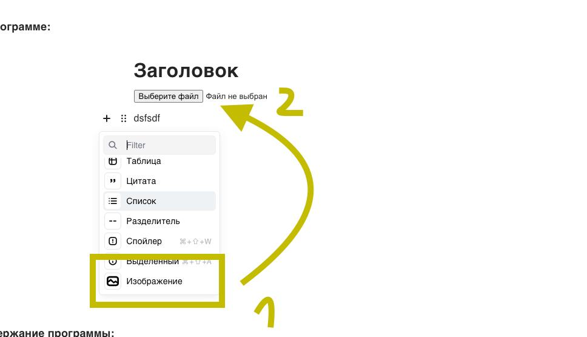

# Simple Image Tool

Provides Image Blocks for the [Editor.js](https://editorjs.io).
Based on https://github.com/editor-js/simple-image and https://github.com/editor-js/simple-image-tutorial/tree/master

Works with pasted images, inserting images via toolbox.
Converts image at BASE 64




## Installation

Get the package

```shell
yarn add @fudgi-packages/editorjs-simple-image
```

```shell
npm i @fudgi-packages/editorjs-simple-image
```

Include module at your application

```javascript
import SimpleImage from "@fudgi-packages/editorjs-simple-image";
```

## Usage

Add a new Tool to the `tools` property of the Editor.js initial config.

```javascript
var editor = EditorJS({
  ...

  tools: {
    ...
    image: SimpleImage,
  }

  ...
});
```

## Config Params

This Tool has no config params

```json
{
  "type": "image",
  "data": {
    "url": "https://www.tesla.com/tesla_theme/assets/img/_vehicle_redesign/roadster_and_semi/roadster/hero.jpg",
    "caption": "Roadster // tesla.com"
  }
}
```
